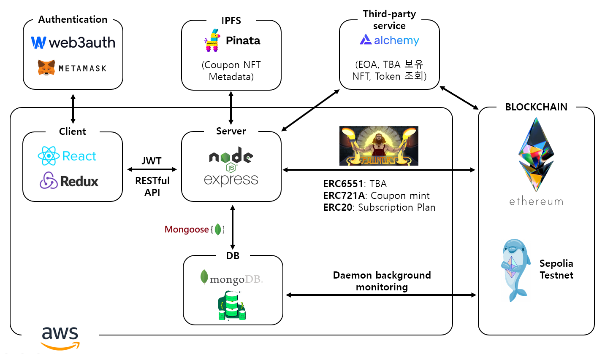
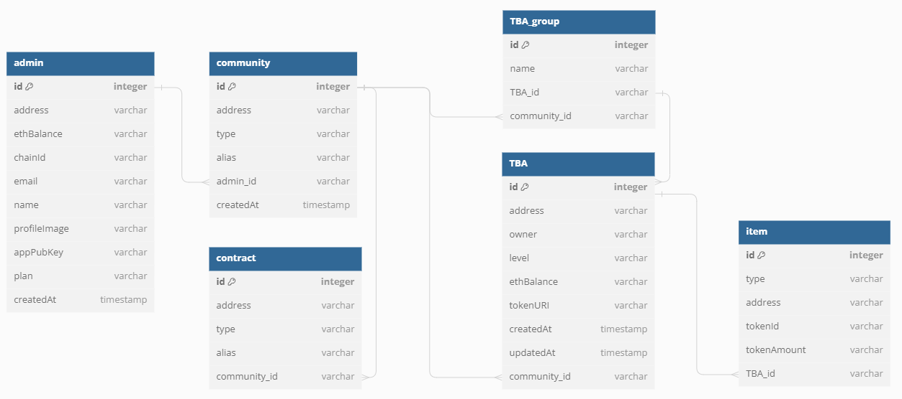
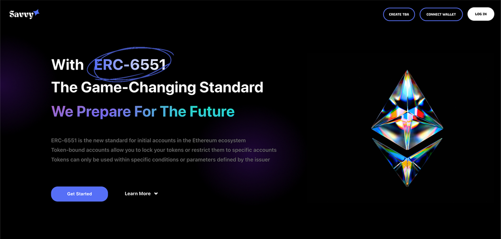
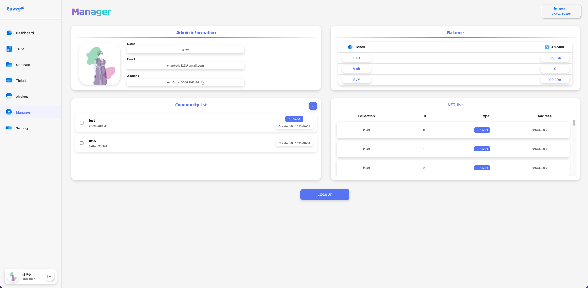
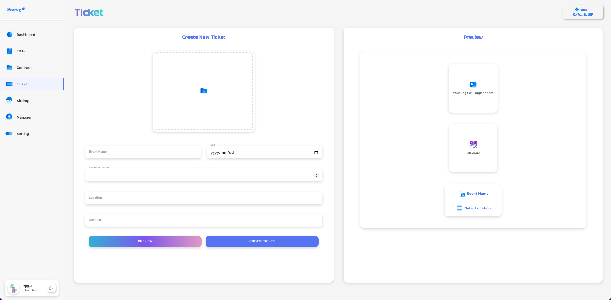

# beb-09-final-01

## 팀명

### Savvy

## 팀 구성 및 역할

- 박찬우(팀장)

  (프론트엔드, 백엔드, 컨트랙트)

<br>

- 한재경

  프론트엔드

  - 웹 애플리케이션의 React 기반 아키텍처 설계 및 구현
  - MUI를 사용하여 반응형 및 사용자 친화적인 웹 인터페이스 디자인 및 구현
  - 사용자 경험(UX) 설계를 통한 UI 개선 제안 및 디자인 작업
  - 피그마를 활용하여 웹 애플리케이션의 로직 구현

<br>

- 금윤수

  백엔드

<br>

- 이상준

  백엔드

  - node.js express framework를 사용하여 server 구현
  - Mongoose(ODM)를 사영하여 MongoDB 연동
  - RESTful API 기능구현: admin, manager, community 등
  - swagger를 사용하여 API Docs 관리
  - Subscription Plan: ERC20 token, 컨트랙트 구현 → Server에서 사용자에게 매달 수금

<br>

## Quick Start

Follow these steps to get started:

### 1. **Installing the foundry and running anvil**:

**foundry**

```bash
$ curl -L https://foundry.paradigm.xyz
$ foundryup
```

### 2. **Contract Deployment**: Deploy the contracts by following the instructions in the [contracts/README.md](./contracts/README.md) file.

### 3. **Server Execution**: Start the server by following the instructions in the [server/README.md](./server/README.md) file.

### 4. **Client Execution**: Run the client application by following the instructions in the [client/README.md](./client/README.md) file.

<br>

## 프로젝트 소개

### 프론트엔드 플로우차트


### 서비스 아키텍처



### DB diagram



## 기술 스택

### Contracts

Foundry - 컨트랙트 배포(`forge`) 및 로컬 블록체인 노드 운영(`anvil`)

### Backend

Express.js - 서버 구축

MongoDB - DB 구축

Mongoose - ODM 이용

Multer - 파일을 다루기 위한 Node.js 미들웨어

Alchemy API - 특정 EOA, TBA 주소가 보유한 모든 NFT, Token 조회

swagger - API docs 관리

PM2 - TBA 실시간 트래킹

PINATA - Coupon NFT metadata 저장을 위한 IPFS

### Frontend

React

Redux

Material UI(MUI) - CSS 라이브러리

Web3auth - google 등 web2 기업 로그인 사용하여 유저 진입장벽 낮추기

## 프로젝트 기간

2023년 7월 17일 ~ 2023년 8월 11일

# Page View

## 🖥️ 시작 페이지



## 🖥️ Setting 페이지


## 🖥️ Manager 페이지



## 🖥️ Airdrop 페이지


## 🖥️ Ticket 페이지



## 🖥️ Contract 페이지


## 🖥️ TBA 페이지


## 🖥️ Dashboard 페이지


