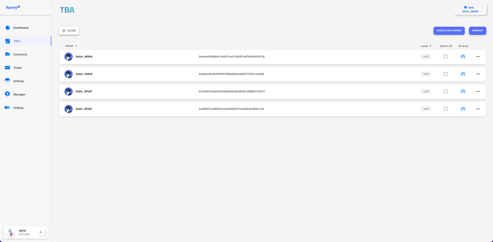

# Savvy


## 프로젝트 소개

현재 NFT는 PFP(Picture for Profile), 게임 내 아이템, 각종 이벤트 참여에 대한 증명서 등의 유틸리티를 가지고 있습니다. 이러한 유틸리티들의 공통점이 하나 있는데, 바로 지속적으로 가치(유틸리티)를 유지하기 위해선 NFT 커뮤니티의 관리가 필연적이란 것입니다.

NFT 커뮤니티를 관리할때, NFT 홀더들을 스냅샷 찍어 특정한 토큰을 에어드랍해줘야 하는 경우가 존재하며, 관리하고 있는 커뮤니티 참여자들에 대한 아이덴티티 파악이 힘든 경우가 거의 대부분입니다. 저희는 이러한 문제에 집중하여, 스냅샷부터 에어드랍까지의 과정을 원클릭으로 가능하게 만들어주고, 커뮤니티 참여자들의 아이덴티티를 쉽게 파악할 수 있는 솔루션을 제공합니다.

### 프로젝트 기간

`2023년 7월 17일 ~ 2023년 8월 11일`

## 프로젝트 주요 기능

“ **ERC6551 based community management tool “**

저희는 크게 네 가지의 서비스를 제공합니다.

> ☝️ 커뮤니티 참여자들에 대한 실시간 모니터링
>
> ☝️ 원클릭으로 스냅샷부터 에어드랍까지
>
> ☝️ 이벤트 티켓 NFT를 쉽게 배포
>
> ☝️ 하나의 계정으로 여러 커뮤니티를 관리

## 팀원 소개

- 박찬우(팀장)

  프론트엔드, DB, 컨트랙트

  - 프로젝트 기획 및 관리
  - 데이터베이스 설계
  - React + Redux를 활용한 프론트엔드 구현
  - API 연동
  - IPFS 및 Multer 사용해 API 구현(NFT Ticket Minting)
  - Foundry 활용하여 스마트 컨트랙트 개발 및 배포

<br>

- 한재경

  프론트엔드

  - 웹 애플리케이션의 React 기반 아키텍처 설계 및 구현
  - MUI를 사용하여 반응형 및 사용자 친화적인 웹 인터페이스 디자인 및 구현
  - 사용자 경험(UX) 설계를 통한 UI 개선 제안 및 디자인 작업
  - 피그마를 활용하여 웹 애플리케이션의 로직 구현

<br>

- 금윤수

  백엔드

  - node.js express framework를 사용하여 server 구현
  - Mongoose(ODM)를 사영하여 MongoDB 연동
  - 실시간 Tracking Daemon.js 구현
  - AWS EC2 서비스를 사용하여 Server 배포
  - AWS S3 서비스를 사용하여 Client 배포

<br>

- 이상준

  백엔드

  - node.js express framework를 사용하여 server 구현
  - Mongoose(ODM)를 사영하여 MongoDB 연동
  - RESTful API 기능구현: admin, manager, community 등
  - swagger를 사용하여 API Docs 관리
  - Subscription Plan: ERC20 token, 컨트랙트 구현 → Server에서 사용자에게 매달 수금

<br>

# Quick Start

Follow these steps to get started:

1.  **Installing the foundry and running anvil**:

**foundry**

```bash
$ curl -L https://foundry.paradigm.xyz
$ foundryup
```

2.  **Contract Deployment**: Deploy the contracts by following the instructions in the [contracts/README.md](./contracts/README.md) file.

3.  **Server Execution**: Start the server by following the instructions in the [server/README.md](./server/README.md) file.

4.  **Client Execution**: Run the client application by following the instructions in the [client/README.md](./client/README.md) file.

<br>

# About Technology

## 유저 플로우차트


## 서비스 아키텍처


## DB diagram


# 기술 스택

## Contracts

<a href="https://github.com/foundry-rs/foundry" target="_blank"></a>


> 컨트랙트 배포(`forge`) 및 로컬 블록체인 노드 운영(`anvil`)

## Backend

 
 
 
 
 


## Frontend


# Page View

## 🖥️ 시작 페이지


## 🖥️ Setting 페이지


## 🖥️ Manager 페이지


## 🖥️ Airdrop 페이지


## 🖥️ Ticket 페이지


## 🖥️ Contract 페이지


## 🖥️ TBA 페이지



## 🖥️ Dashboard 페이지


# 상세 정보

- #### [**Whitepaper**](https://cooked-force-1fa.notion.site/Whitepaper-71062e9be6884f64837712a8f488c2d4?pvs=4)

- #### [**제품 소개 영상**](https://youtu.be/tstMMHnTRw8)

- #### [**API DOCS**](http://52.79.163.209:8080/api-docs/)
